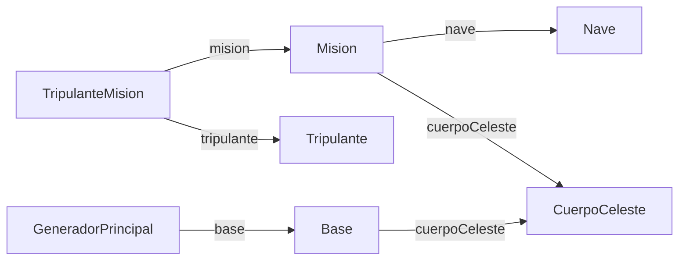

Value Objects (VOs) are plain Java beans used to transfer data between the DAO layer and application logic. Each VO maps to a corresponding database table. Foreign-key relationships are represented as direct object references rather than raw integer identifiers.

<Tip>
  Fields that hold object references (e.g., `Mision.nave`) are only partially populated when returned from a DAO query — only the columns selected in that query's SQL are set.
</Tip>

---

## Mision

**Package:** `eu.esa.gemis.vo`  
**Table:** `T_MISION`

Represents a space mission. Holds references to the assigned spacecraft and destination celestial body.

| Field | Java type | Description |
|---|---|---|
| `identificador` | `int` | Primary key (`id_mision`). |
| `nombre` | `String` | Mission name. |
| `nave` | `Nave` | Reference to the assigned spacecraft (`cod_nave` FK). |
| `cuerpoCeleste` | `CuerpoCeleste` | Reference to the destination celestial body (`id_cuerpo_celeste` FK). |
| `fechaInicio` | `LocalDate` | Mission start date (`fecha_inicio`). |
| `fechaFinEstimado` | `LocalDate` | Estimated end date (`fecha_fin_estimado`). |
| `fechaFin` | `LocalDate` | Actual end date (`fecha_fin`). May be `null` for ongoing missions. |
| `estado` | `String` | Current mission status (`estado`). |
| `objetivoPrincipal` | `String` | Primary mission objective (`objetivo_principal`). |
| `presupuestoAsignado` | `int` | Allocated budget in mission currency (`presupuesto_asignado`). |

**`toString()` format:**
```
Mision [identificador=<id>, nombre=<nombre>, nave=<nave.toString()>,
        cuerpoCeleste=<cuerpoCeleste.toString()>, fechaInicio=<fechaInicio>,
        fechaFinEstimado=<fechaFinEstimado>, fechaFin=<fechaFin>,
        estado=<estado>, objetivoPrincipal=<objetivoPrincipal>,
        presupuestoAsignado=<presupuestoAsignado>]
```

<Note>
  `toString()` appends a trailing newline (`\n`), which is intentional for console output formatting.
</Note>

---

## Tripulante

**Package:** `eu.esa.gemis.vo`  
**Table:** `T_TRIPULANTE`

Represents an ESA crew member.

| Field | Java type | Description |
|---|---|---|
| `numeroTripulante` | `int` | Auto-incremented primary key (`numero_tripulante`). |
| `nombre` | `String` | First name. |
| `apellidos` | `String` | Surname(s). |
| `identificadorEsa` | `int` | ESA-assigned numeric identifier (`identificador_esa`). Used as a lookup key by `ITripulanteDAO`. |
| `nivelExperiencia` | `int` | Experience level (`nivel_experiencia`). |
| `especialidad` | `String` | Area of specialisation (`especialidad`). |
| `fechaIngresoEsa` | `LocalDate` | Date the crew member joined the ESA (`fecha_ingreso_esa`). |

**`toString()` format:**
```
Tripulante [numeroTripulante=<n>, nombre=<nombre>, apellidos=<apellidos>,
            identificadorEsa=<id>, nivelExperiencia=<nivel>,
            especialidad=<especialidad>, fechaIngresoEsa=<fecha>]
```

<Note>
  `toString()` appends a trailing newline (`\n`), consistent with `Mision`.
</Note>

---

## Nave

**Package:** `eu.esa.gemis.vo`  
**Table:** `T_NAVE`

Represents a spacecraft.

| Field | Java type | Description |
|---|---|---|
| `codigo` | `String` | Primary key — spacecraft code (`codigo`). |
| `nombre` | `String` | Spacecraft name. |
| `tipo` | `String` | Spacecraft type classification (`tipo`). |
| `capacidadTripulacion` | `int` | Maximum crew capacity (`capacidad_tripulacion`). |
| `autonomiaDias` | `short` | Maximum operational autonomy in days (`autonomia_dias`). |

**`toString()` format:**
```
Nave [codigo=<codigo>, nombre=<nombre>, tipo=<tipo>,
      capacidadTripulacion=<n>, autonomiaDias=<n>]
```

---

## CuerpoCeleste

**Package:** `eu.esa.gemis.vo`  
**Table:** `T_CUERPO_CELESTE`

Represents a celestial body (planet, satellite, asteroid, etc.) that serves as a mission destination.

| Field | Java type | Description |
|---|---|---|
| `identificador` | `int` | Primary key (`identificador`). |
| `nombre` | `String` | Name of the celestial body. Used as a lookup key in `actualizarMisionPorNaveCuerpoFecha`. |
| `tipo` | `String` | Classification (e.g., `"planeta"`, `"satélite"`). |
| `gravedadSuperficieMs2` | `double` | Surface gravity in m/s² (`gravedad_superficie_ms2`). |

**`toString()` format:**
```
CuerpoCeleste [identificador=<id>, nombre=<nombre>, tipo=<tipo>,
               gravedadSuperficieMs2=<valor>]
```

---

## Base

**Package:** `eu.esa.gemis.vo`  
**Table:** `T_BASE`

Represents a space base. Holds an object reference to the celestial body on which it is located.

| Field | Java type | Description |
|---|---|---|
| `identificador` | `int` | Primary key (`identificador`). |
| `nombre` | `String` | Base name. |
| `funcionPrincipal` | `String` | Primary function or purpose of the base (`funcion_principal`). |
| `fechaEstablecimiento` | `LocalDate` | Date the base was established (`fecha_establecimiento`). |
| `estado` | `String` | Operational status (`estado`). |
| `cuerpoCeleste` | `CuerpoCeleste` | Reference to the host celestial body (`id_cuerpo_celeste` FK). |

**`toString()` format:**
```
Base [identificador=<id>, nombre=<nombre>, funcionPrincipal=<funcion>,
      fechaEstablecimiento=<fecha>, estado=<estado>,
      cuerpoCeleste=<cuerpoCeleste.toString()>]
```

---

## GeneradorPrincipal

**Package:** `eu.esa.gemis.vo`  
**Table:** `T_GENERADOR_PRINCIPAL`

Represents a primary power generator assigned to a space base. Holds an object reference to that base.

| Field | Java type | Description |
|---|---|---|
| `identificador` | `int` | Primary key (`identificador`). |
| `nombre` | `String` | Generator name. |
| `tipo` | `String` | Generator type classification (`tipo`). |
| `potenciaMw` | `double` | Rated power output in megawatts (`potencia_mw`). |
| `base` | `Base` | Reference to the host space base (`id_base` FK). |

**`toString()` format:**
```
GeneradorPrincipal [identificador=<id>, nombre=<nombre>, tipo=<tipo>,
                    potenciaMw=<valor>, base=<base.toString()>]
```

---

## TripulanteMision

**Package:** `eu.esa.gemis.vo`  
**Table:** `T_TRIPULANTE_MISION`

Represents the assignment of a crew member to a mission. This is a join-entity VO — it has no surrogate primary key. Both foreign keys are modelled as full object references.

| Field | Java type | Description |
|---|---|---|
| `mision` | `Mision` | Reference to the assigned mission (`id_mision` FK). |
| `tripulante` | `Tripulante` | Reference to the assigned crew member (`num_tripulante` FK). |
| `rol` | `String` | Role of the crew member within this mission (`rol`). |

**`toString()` format:**
```
TripulanteMision [mision=<mision.toString()>, tripulante=<tripulante.toString()>, rol=<rol>]
```

---

## Object relationship diagram


